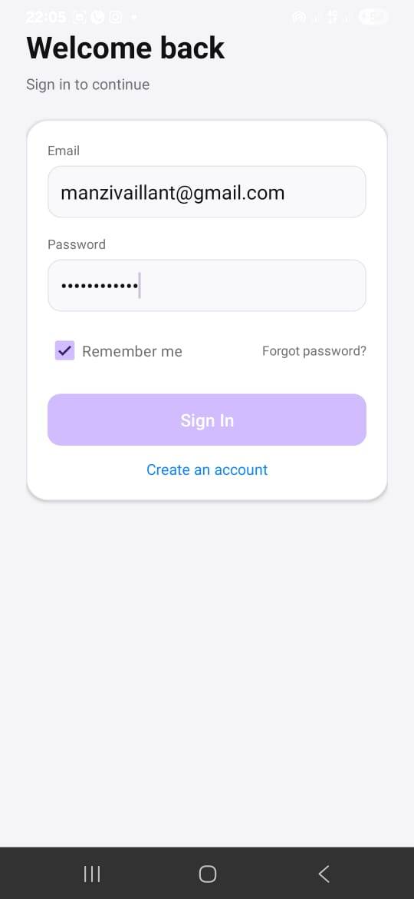
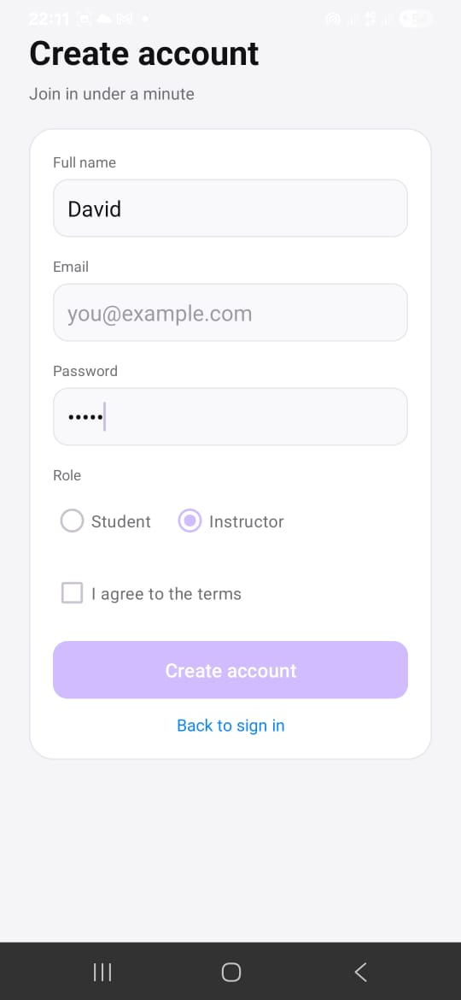
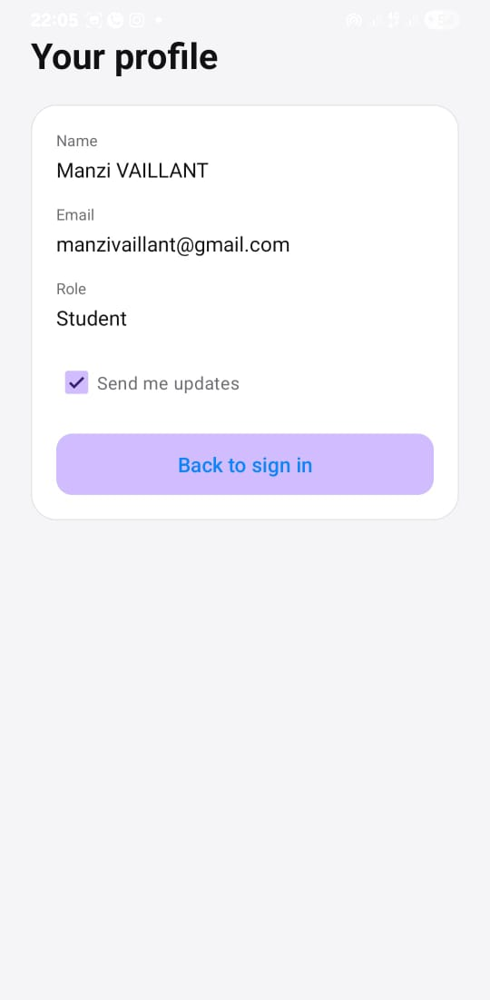
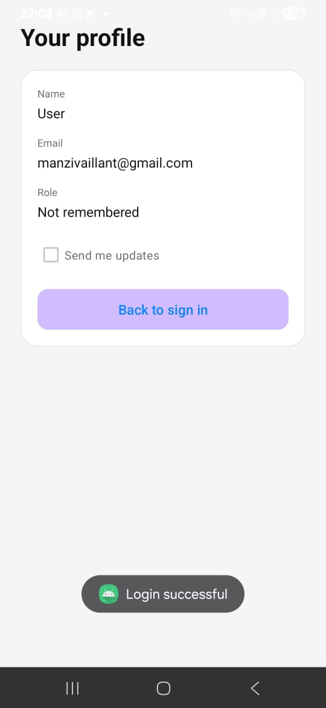
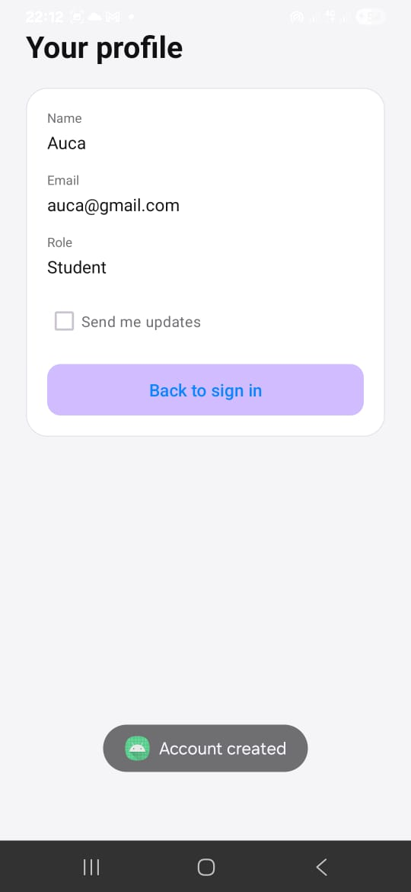

## Assignment 2  Mobile Programming, 2025-2026

## What I built
- Android app with three Activities: Login, Sign-Up, User Details.
- XML layouts with common widgets (ConstraintLayout/LinearLayout, TextView, EditText, Button, RadioButton, CheckBox).
- Navigation between all required screens.

## Behavior
- Validation on Login and Sign-Up (required fields + terms checkbox).
- User Details shows submitted data; Login defaults name to "User" and sets role from remember-me.

## Extra Credit
- Toasts for success and missing fields.

## Screenshots 
# LOGIN SCREEN 

# SIGN UP SCREEN 

# USER DETAILS SCREEN 

# TOAST LOGIN

# TOAST ACCOUNT CREATED

# TOAST MISSING FIELDS

